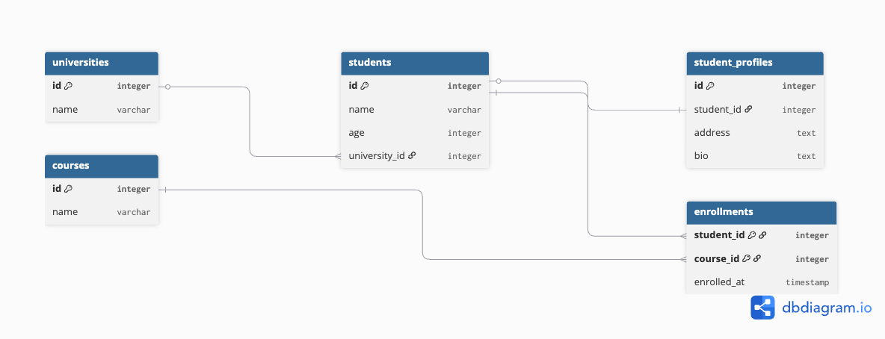

# Module 4: Relational Model Design 

## 1. Objective

The goal of this task was to design and implement a robust relational database schema for the Student Management domain, ensuring data integrity through normalization and proper relationship mapping.

---

## 2. Relational Schema Design

I have implemented a schema that fulfills all three mandatory relationship types:

### A. Relationship Mapping

| Relationship Type | Implementation | Description |
| --- | --- | --- |
| **One-to-One (1:1)** | `students` ↔ `student_profiles` | Each student has exactly one profile. Guaranteed by a `UNIQUE` constraint on the `student_id` foreign key. |
| **One-to-Many (1:M)** | `universities` ↔ `students` | A university can host many students, but each student belongs to only one university. |
| **Many-to-Many (M:M)** | `students` ↔ `courses` | Resolved via the `enrollments` **Join Table**. This allows multiple students to enroll in multiple courses. |

### B. Normalization Laws Applied

* **1st Normal Form (1NF):** All columns contain atomic values. Multi-valued attributes (like courses) are moved to a separate table.
* **2nd Normal Form (2NF):** Removed partial dependencies; all non-key attributes are fully functional on the primary key.
* **3rd Normal Form (3NF):** Removed transitive dependencies. University details (like names) are kept in the `universities` table and referenced by ID, preventing data redundancy.

---

## 3. Technical Implementation

### Database Initialization

* **Idempotency:** I used `CREATE TABLE IF NOT EXISTS` in the SQL scripts. This ensures that when using **Docker Volumes**, the container does not fail or error out if the tables already exist from a previous run.
* **Naming Conventions:** Followed industry standards:
* **Tables:** Pluralized lowercase (e.g., `students`, `courses`).
* **Columns:** Snake_case (e.g., `university_id`, `enrolled_at`).
* **Primary Keys:** Consistent `id` column with `SERIAL` type for auto-increment.

### Referential Integrity

I implemented specific **Foreign Key Constraints** to handle data cleanup:

* **`ON DELETE CASCADE`**: Used for `student_profiles` and `enrollments`. If a student is deleted, their related metadata is automatically removed to prevent "orphan" records.
* **`ON DELETE SET NULL`**: Used for the university reference. If a university is removed from the system, the student record remains intact but the university link is cleared.

---

## 4. SQL Querying & Statistics

To verify the business logic of the model, I implemented the following complex queries:

1. **Joined Search:** A query that combines `students`, `universities`, and `courses` to show a complete student profile.
2. **Aggregation (Statistics):** Counting students per university using `GROUP BY` and `COUNT`.
3. **Top-N Query:** Identifying the top 3 most popular courses based on enrollment volume.

---

## 5. Docker Integration

The schema is fully automated via `docker-compose.yml`.

* **Volume Mapping:** `./init-db:/docker-entrypoint-initdb.d`
* **Persistence:** A named volume ensures that data survives container restarts.
* **Configuration:** Custom credentials are passed securely via a `.env` file.
  
---

---
## ER_Diagram

